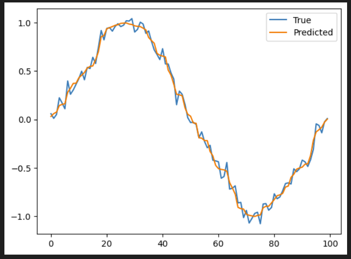
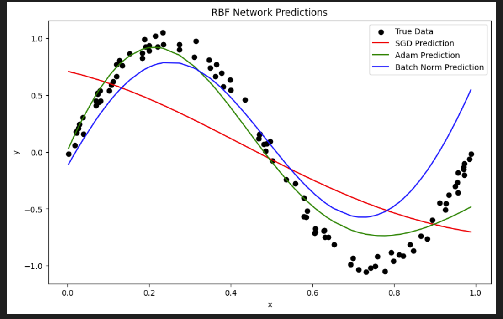
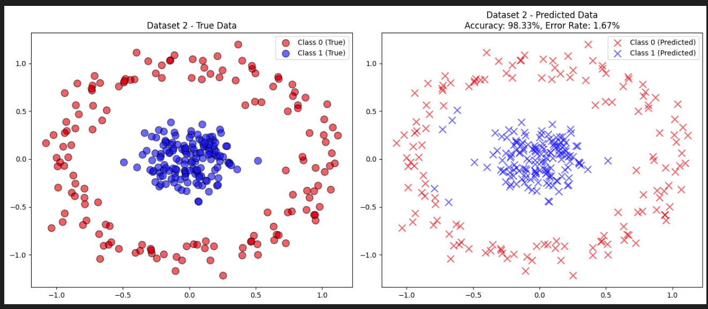

## Radial Basis Function (RBF) Algorithm Overview

### Introduction:
The **Radial Basis Function (RBF)** algorithm is a type of artificial neural network used primarily for regression tasks, though it can also be applied to classification problems. The RBF network operates by transforming the input space using a radial function, which is typically a Gaussian function. The RBF network is a simple yet powerful model due to its localized, distance-based approach to learning.

### Structure of RBF Networks:
An RBF network consists of three main layers:
1. **Input Layer**: Receives the input data directly.
2. **Hidden Layer**: Applies a radial basis function (usually Gaussian) to the input. Each neuron in this layer represents a radial function centered at a particular point, called the "center." The outputs of this layer are dependent on the distance between the input data and the centers.
3. **Output Layer**: Produces the final output by combining the transformed inputs (from the hidden layer) with weights assigned to each connection.

### Key Components:
- **Centers**: The central points of the radial basis functions. These can be initialized either randomly or using algorithms like KMeans.
- **Beta**: This is a parameter that controls the width of the Gaussian function. A smaller beta leads to a wider Gaussian, while a larger beta makes it narrower.
- **Weights**: These are learned during the training process and help in mapping the transformed data to the final output.

### Working of the RBF Algorithm:
1. **Center Initialization**: In the RBF network, the centers of the radial functions are initialized using either random assignment or a clustering technique like KMeans. The KMeans-based initialization often results in better clustering of the input data.
2. **Distance Calculation**: The algorithm computes the distance between each input data point and the centers of the radial functions. This distance is passed through the Gaussian function to transform the input space.
3. **Output Calculation**: The outputs of the hidden layer are combined linearly in the output layer, producing the final prediction.

### Model Training:
The network is trained by minimizing the **mean squared error (MSE)** between the predicted and actual values. The learning rate and the number of epochs are key factors in determining how quickly and accurately the network converges during training.

### Applications:
The RBF network is widely used in:
- Function approximation
- Regression tasks
- Time series prediction
- Image recognition and classification

### Conclusion:
The RBF network is a flexible model that, with proper initialization and tuning of hyperparameters, can perform very well on regression tasks. The method's strength lies in its ability to adapt to localized changes in the data due to the radial basis functions.

### Example Results:
The images below show sample outputs generated by this RBF algorithm.


  
  
  

